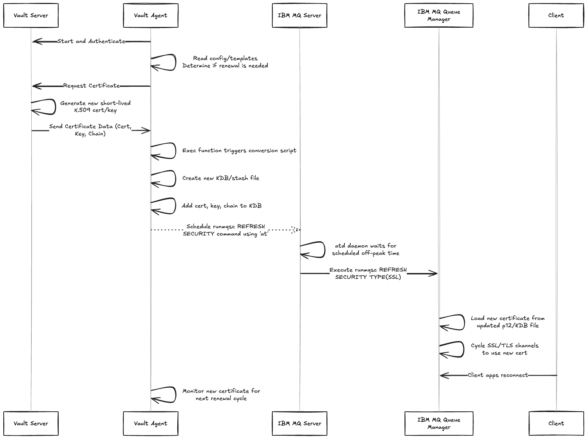

# Introduction

In today’s security landscape, frequent certificate rotation is no longer a best practice \- it's a mandatory necessity. Digital certificates, which underpin the TLS/SSL security of systems like IBM MQ queue managers and their channels, must be regularly updated to minimize the attack surface and limit the potential damage from an outdated or compromised key. The industry's evolving standards, notably the push by the CA/Browser Forum toward a 47-day maximum lifespan for public TLS certificates (scheduled for full enforcement by March 2029), underscore a critical shift: what used to be an annual or bi-annual task is rapidly becoming a monthly operational requirement.

For many organizations using IBM MQ, this new tempo presents a significant challenge. Current certificate management is often a tedious, multi-step manual workflow involving generating Certificate Signing Requests (CSRs), coordinating with a Certificate Authority (CA), updating the queue manager's Key Database (KDB) with the new certificate, and finally issuing a [REFRESH SECURITY](https://www.ibm.com/docs/en/ibm-mq/9.4.x?topic=reference-refresh-security-refresh-security-settings) command. This process is complex, prone to human error, and, most critically, typically requires scheduled maintenance windows. This reliance on disruptive, slow, and infrequent manual rotation creates an inherent security vulnerability by leaving long-lived certificates exposed for months.

This post will detail a modern, automated solution leveraging HashiCorp Vault (and Vault Agent) to eliminate the manual toil and disruption of certificate rotation in IBM MQ. By integrating Vault's robust Public Key Infrastructure (PKI) secrets engine with the local control provided by Vault Agent, we can transition from time-consuming, disruptive maintenance windows to an agile, automated cycle that not only meets but exceeds the future standard for certificate rotation, ensuring security without sacrificing service availability.

# How Vault Agent Eliminates the Certificate Rotation Burden

The fundamental problem with traditional IBM MQ certificate management is that it relies on a manual, centralized process to update the queue managers and their key databases. HashiCorp Vault Agent is designed to bring certificate lifecycle management directly to the IBM MQ servers and automate certificate renewal and rotation.

## **Transforming Certificates into Dynamic Secrets**

Vault Agent acts as an intelligent client daemon that runs alongside the queue manager. It authenticates securely to a HashiCorp Vault server, which is running the [Public Key Infrastructure (PKI) secrets engine](https://developer.hashicorp.com/vault/docs/secrets/pki). This engine acts as a highly secure, automated Certificate Authority (CA) that issues short-lived certificates, treating them as dynamic secrets.

The Agent's primary value for IBM MQ is two-fold:

1. Automated Certificate Renewal: The Agent is configured to continuously monitor the validity period of the certificate issued by Vault. Well before the certificate expires (e.g., at the 75% mark of its time to live (TTL)), the Agent automatically requests a new certificate from Vault. This auto-renewal capability entirely removes the need for human intervention, manual tracking, or ticket-based renewal workflows, effectively eliminating the risk of an expired certificate causing an outage.  
2. Secret Template Rendering: [Vault Agent templating](https://developer.hashicorp.com/vault/docs/agent-and-proxy/agent/template) enables automated rendering of secrets from HashiCorp Vault by processing user-defined templates, ensuring applications always have up-to-date credentials without manual intervention.  
   For IBM MQ, this means the Agent can:  
   * Fetch the private key and the newly issued certificate chain  
   * Dynamically render these components into the exact format required: PCKS\#12 or Key Database (KDB) files  
   * Overwrite the old p12/KDB file (or create a new one), ensuring the new certificate is available once the channels are restarted

## **Enabling Automatic Security Refresh**

Vault Agent can be configured to execute a local [command](https://developer.hashicorp.com/vault/docs/agent-and-proxy/agent/template#exec), run a script, or send a signal whenever a new secret (in this case, a certificate) is written to the file system. In the context of IBM MQ, this allows the Agent to automatically execute the necessary administrative commands, specifically, the `REFRESH SECURITY TYPE(SSL)` command, after deploying the new certificate files. This command can be run directly after the certificate has been updated or [scheduled](https://www.redhat.com/en/blog/linux-at-command) for an off-peak time when the impact of the channel restart would be minimized.

This automated sequence drastically shortens the operational window for rotation. Instead of a planned, hours-long maintenance window, the rotation becomes a routine, non-disruptive event that only involves the brief channel restart caused by the `REFRESH SECURITY` command. This continuous, short-cycle rotation allows the organization to effortlessly comply with the 47-day certificate standard.

# Step by Step \- Interactions Between Vault Agent and IBM MQ

Note: the Vault agent should be run as the mqm user to ensure that it has proper access to update the p12/KDB files.

1. Vault Agent starts and authenticates to Vault  
2. Agent reads its configuration file and templates, determines which certificates need to be renewed  
3. Agent requests a certificate from the configured Vault PKI role  
4. Vault PKI generates a new, short-lived X.509 certificate and private key  
5. Vault sends the certificate data back to the Agent  
6. Agent receives the new certificate, private key, and certificate chain  
7. Agent overwrites the old KDB and stash files on the local disk or creates a new one that will be updated in the QM keyring  
8. Agent's exec function triggers a local shell script that converts the certificates and key into the required PCKS\#12 file or IBM MQ Key Database (KDB) format  
9. Script (running as the mqm user) uses the [at command](https://www.redhat.com/en/blog/linux-at-command) to schedule the `runmqsc` commands (e.g. `REFRESH SECURITY TYPE(SSL)`) for a future off-peak time  
10. atd daemon waits for the scheduled time and executes the scheduled `runmqsc` command as the mqm user  
11. IBM MQ Queue Manager receives the `REFRESH SECURITY` command  
12. Queue Manager loads the new certificate from the updated p12/KDB file  
13. Queue Manager cycles its SSL/TLS channels to reload security configuration  
14. Client applications briefly reconnect using the new certificate  
15. Agent automatically monitors the new certificate for its next renewal cycle

# Example Vault Agent Template and Script

[https://github.com/lawnjarae/ibm-mq-vault-agent-certificate-renewal/tree/main/agent](https://github.com/lawnjarae/ibm-mq-vault-agent-certificate-renewal/tree/main/agent) 

# Caveats and why this isn’t a universal workflow

While this process does enable fully automated certificate renewals, it may not work for every situation. It's crucial to understand that shifting certificate management from an organizational procedure to an automated process introduces constraints that may conflict with existing security, operational, or architecture standards.

## Clients are unable to handle reconnection logic

This workflow eliminates the long, scheduled maintenance window, but it does not eliminate the service interruption. The core mechanism, the `REFRESH SECURITY` command, is necessary and forces the queue manager to cycle all active SSL/TLS channels. Every client connecting to the queue manager must be built to handle an unexpected disconnection and automatically attempt to reconnect without manual intervention or application failure. Clients that lack this reconnection logic will fail when the automated refresh runs, potentially causing data loss or requiring a manual restart.

## Extremely low disruption tolerance for clients

For certain high-value messaging platforms, such as those used in real-time financial trading, inter-bank transfers, or payment processing (especially in the FINS sector), there may be a business requirement for zero service disruption. While the certificate refresh is brief, any interruption, even when scheduled, can cause lost trade opportunities, transactional timing errors, or cascade failures in upstream systems. If business requirements mandate absolute service continuity, you may need to rely on complex, non-MQ-native solutions like proxy termination to handle certificate rotation, rather than using the `REFRESH SECURITY` command itself.

## Inter-queue manager channels / mTLS

When mTLS is required, this workflow does not have any built-in coordination between clusters to synchronize the certificate update and security refresh event. If one side of the channel is updated with a new certificate, the channel will remain broken until the other side updates its certificate and reloads its security context. 

## MQ is deployed on z/OS

At the current time, Vault agent is not able to run on z/OS to handle this workflow. As an alternative, Ansible Automation Platform and Vault can be combined to identify expiring certificates stored in RACF, generate new certificates via CSR to Vault, and store the new certificates in RACF. With the power and flexibility of Ansible, this process is completely customizable ensuring that like the Vault agent, post renewal scripts can handle the `REFRESH SECURITY` event. A more detailed walkthrough of this workflow can be found [here](https://ibm.box.com/s/fxsgclpebujt5693rylss1547cyq0pn3).

# Alternative designs considered

## Decoupling certificate renewal from channel refresh (manual approval gates)

The power of Vault Agent is its ability to trigger an action immediately upon successfully writing a new certificate. However, some organizations may want the security benefit of automation (the certificate is renewed and ready) but require human control over the disruption (when the channel cycles). The workflow is flexible enough to allow this:

1. Modify the exec action: The Vault Agent's exec block can be configured to only perform the KDB update and not execute the at command that schedules the  `REFRESH SECURITY` event.  
2. Manual Trigger: The new certificate will sit idle in the KDB. The operations team can then use an existing change control system to schedule the final `runmqsc` command for a time that aligns with their existing process, using the new certificate when they are ready. This preserves the short TTL and automated key rotation while reintroducing a necessary human approval gate before service disruption.

# Additional Resources

Application authentication to Vault: [https://developer.hashicorp.com/validated-designs/vault-operating-guides-adoption/authentication-for-applications](https://developer.hashicorp.com/validated-designs/vault-operating-guides-adoption/authentication-for-applications)

Vault agent configuration: [https://developer.hashicorp.com/validated-designs/vault-operating-guides-adoption/static-secrets\#vault-agent](https://developer.hashicorp.com/validated-designs/vault-operating-guides-adoption/static-secrets#vault-agent) 

# Author

Justin Jarae

# Contributors

Joani Delaporte, Brian Paskin, Rob Parker, David Ware
